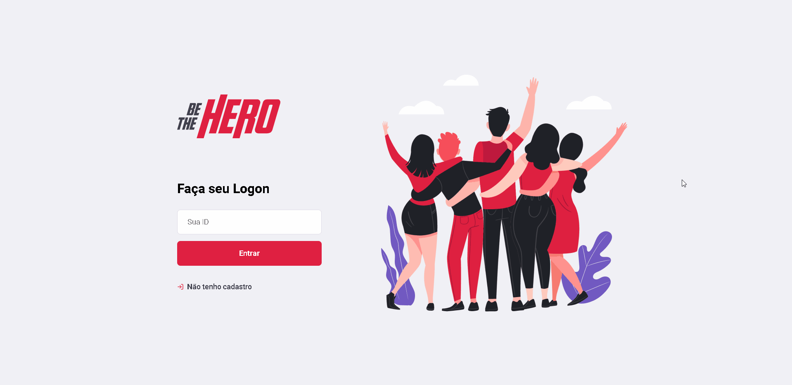

<h1 align="center">
  
</h1>

 

## **<h2 align="center">Full Stack application 📟 👨‍💻</h2>**

## 
<h2 align="center">Application that connects ONGs to those who want to contribute to the cause</h2> 

# **ONG registration and login page - Web Layout** 💻

  

 

# **Listing, registration and exclusion of cases - Web Layout** 💻

  

 

<h3 align="center"> 
	Application status: Developed ✔️
</h3>
 

## :star: Features
- [x] ONG register
- [x] Registration of new cases involving the ONG
- [x] List of ONG cases

## :rocket: Technologies used:

 

## :information_source: Application installation
- `git clone https://github.com/mathwcruz/be_the_hero_SO_11.git` to clone the repository

 

# Frontend
To run the application on the web, follow the instructions:
- Go to `frontend` folder
- `npm i` or `yarn install` to install project dependencies
- After downloading the dependencies, run `npm start` or `yarn start` to run the application
- Link to the [web application](https://be-the-hero-semana-omnistack-11.netlify.app/)

 

# Backend
To run the server, follow the instructions:
- Go to `backend` folder
- `npm i` or `yarn install` to install project dependencies
- After downloading the dependencies, run `npm start` or `yarn start` to run the server

### Author
---

<a href="https://app.rocketseat.com.br/me/matheus-da-cruz-frontend">
 
  
 <b>Matheus da Cruz</b></a> <a href="https://app.rocketseat.com.br/me/matheus-da-cruz-frontend" title="Rocketseat">  🚀</a>

 

 

## **
First project developed with ReactJS 👨‍💻
**

## **
Starting the walk to be able to participate in the marathon in this programming world 🏃‍
**

### 
 <h2 align="center">Another application made by Matheus da Cruz 👨‍💻 </h2> 

